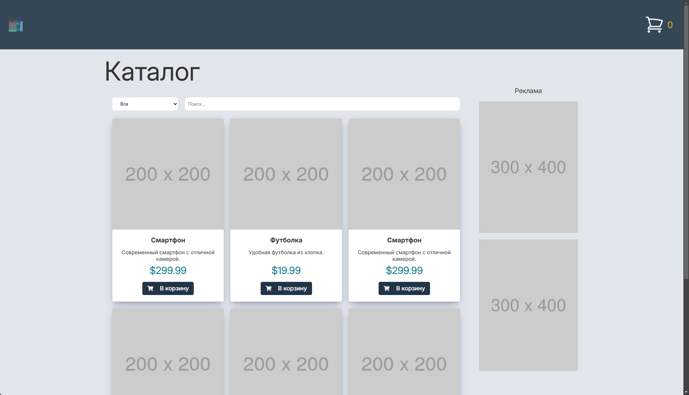

# SPA Catalog

URL: [https://spa-catalog.vercel.app](https://spa-catalog.vercel.app/)



### Технологии:

- React.js
- TypeScript
- Redux Toolkit
- SCSS Modules
- ESLint
- Prettier

## 🐱‍💻 Команды

| Command            | Action                                    |
| :----------------- | :---------------------------------------- |
| `npm install`      | Установить зависимости                    |
| `npm run dev`      | Запустить локальный дев сервер            |
| `npm run build`    | Создать оптимизированный production build |
| `npm run preview`  | Запустить production build                |
| `npm run lint`     | Запустить линтер                          |
| `npm run prettier` | Форматировать код с настройками prettier  |

## 🚀 Структура

```text
├── public/                 # статические файлы (иконки, картинки и тп.)
│   ├── icons
│   └── image
├── src/
│   ├── components/         # компоненты ( могут обладать бизнес-логикой )
│   │   ├── header/
│   │   ├── ...
│   │   └── index.ts
│   ├── shared/             # общее ( переиспользуемые глобальные сущности не имеющие конкретной привязки )
│   │   ├── const/
│   │   ├── hooks/
│   │   ├── service/
|   |   |   ├── bannersService.ts
|   |   |   ├── productsService.ts
│   │   ├── styles/
|   |   |   ├── animations.scss
|   |   |   ├── normalize.scss
|   |   |   ├── func.scss
|   |   |   ├── global.scss
|   |   |   ├── index.scss
|   |   |   ├── mixins.scss
|   |   |   └── variables.scss
│   │   ├── types/
│   │   └── store.ts
│   ├── ui/                 # элементы интерфейса ( базовые переиспользуемые ui компоненты )
│   │   ├── button/
│   │   ├── ...
│   │   └── index.ts
│   └── pages/              # страницы ( лэйауты страниц )
│       ├── home/
│       └── ...
├── package.json
└── ...
```
